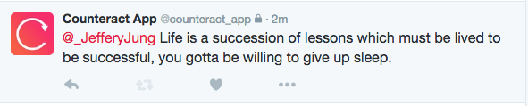
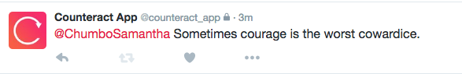

# Counteract

Welcome to the repository for Counteract, a crowdsourced risk analysis platform
for sending nice messages to people who may be having a bad day or show signs of threatening behavior to themselves or others. 

## Info:
We utilized (Hierarchical Attention Networks)[https://www.cs.cmu.edu/~diyiy/docs/naacl16.pdf] for classification on public tweets to classify tweets as happy/sad, then a Markov chain on encouraging tweets to generate a happy message to tweet at the person who tweeted something sad.

## Demo:
The following tweets are 100% generated through our system with no human interference :)

## File Importance:

* posts.txt - A list of tweets we mined with a tweet on each line
* classify.txt - A list of classifications corresponding to posts.txt that we classified as happy/sad
* encouraging.txt - A list of encouraging messages/quotes that we used to train the Markov chain
* requirements.txt - A list of Python requirements required to run our project, along with Scikit-Learn and Numpy

* gettweets.py - Our tweet mining file that saved the tweets into posts/classify.txt
* nlp1.py - Our original text classification engine courtesy of [Patrick Demichele](http://github.com/patdemichele)
* index.py - Our main Python file that streams tweets and generates responses to the sad tweets.

## Contributors

The following individuals are currently contributing to Counteract: Jay Shenoy,
Andy Kamath, Patrick DeMichele, Karan Kanwar, Kelsey Nieman, Matt Zhou, Michelle Huang, and Rufus Behr.
